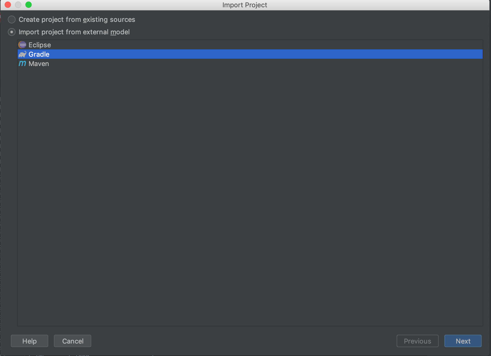

Doma Kotlin Sample
==================

Before You Start
----------------

### Get JDK

You need JDK 8+.

### Get the Source Code

```sh
$ git clone https://github.com/domaframework/kotlin-sample.git
$ cd kotlin-sample
```

Import this project to IntelliJ IDEA
------------------------------------

Start your IntelliJ IDEA.
In this document, we use IntelliJ IDEA 2019.2.

Select "File > New > Project from Existing Sources..." from the menu bar and choose "Gradle":


Build and Run with IDEA
-----------------------

Select "Build > Build Project" from the menu bar and Run 'AppKt'.

Build with Gradle
-------------------------

Use `./gradlew` command:

```sh
./gradlew build
```

Document
--------

- [Kotlin support](http://doma.readthedocs.io/en/stable/kotlin-support/)

