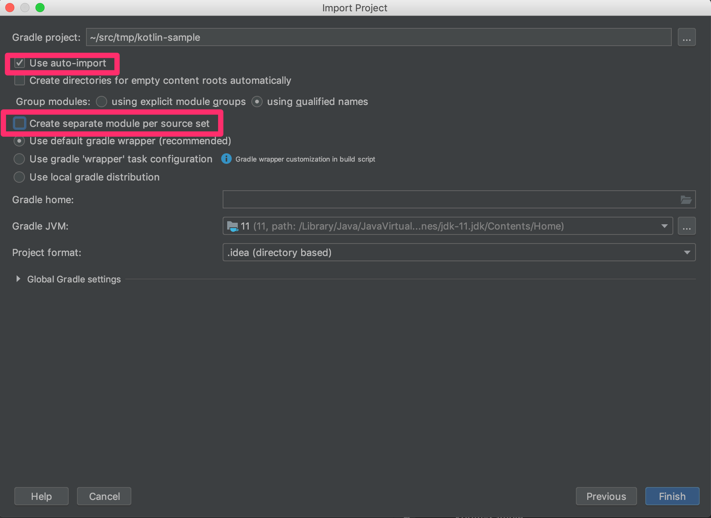
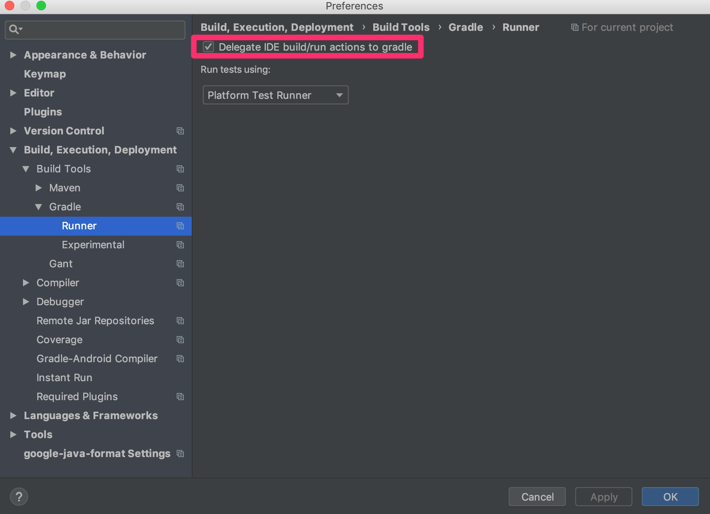

Doma Kotlin Sample
==================

Before You Start
----------------

### Get JDK

You need JDK 8+.

### Get the Source Code

```sh
$ git clone https://github.com/domaframework/kotlin-sample.git
$ cd kotlin-sample
```

Build with Gradle
-----------------

Use `./gradlew` command:

```sh
./gradlew build
```

Import this project to IntelliJ IDEA
------------------------------------

Generate files used by IntelliJ IDEA:

```sh
./gradlew idea
```

Start your IntelliJ IDEA.

Select "File > New > Project from Existing Sources..." from the menu bar and choose "Gradle":


Check the box "Use auto-import" and uncheck the box "Create separate module per source set": 


When you finish importing the project, check the box
"Delegate IDE build/run actions to gradle" in the preferences dialog:


Document
--------

- [Kotlin support](http://doma.readthedocs.io/en/stable/kotlin-support/)

